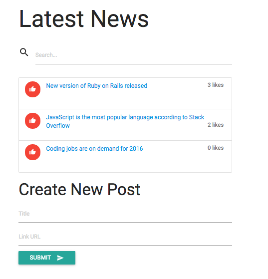

# React Latest News

An example of how to use React as your front-end framework.



## Installation

You will need Node to run the fake backend. Download the `json-server` npm module:

```
npm install -g json-server
```

Then, to run the backend:

```
json-server --watch api/db.json
```

Though ideally you would run the frontend server separately, you will have access to index.html via json-server at the following: http://localhost:3000/

Your fake API will be served at the endpoint http://localhost:3000/posts
